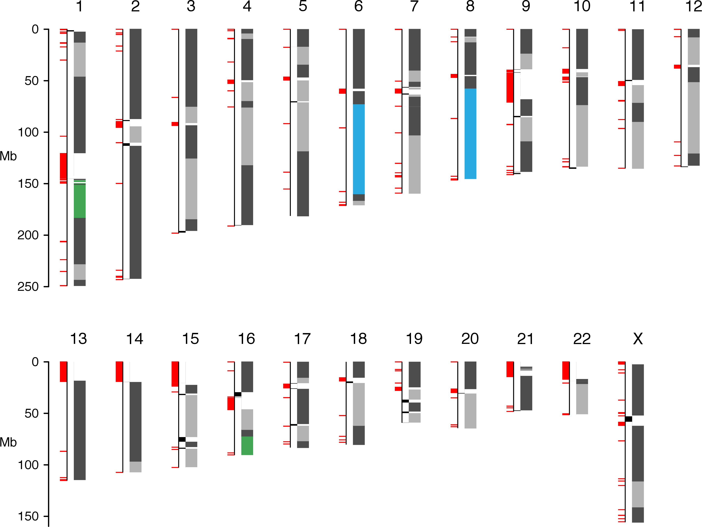
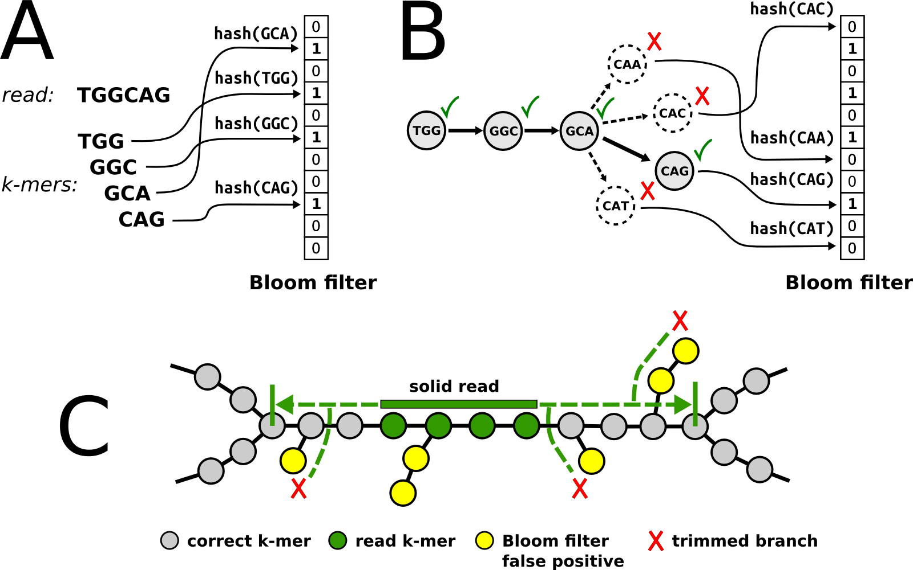
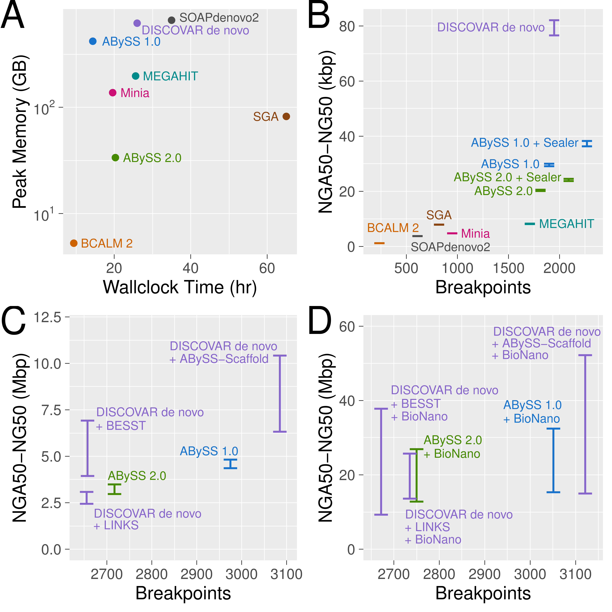

## ABySS 2.0

### Resource-efficient assembly of large genomes using a Bloom filter

**Shaun D Jackman** [\@sjackman][]

Benjamin P Vandervalk, Hamid Mohamadi, Justin Chu, Sarah Yeo, S Austin Hammond, Golnaz Jahesh, Hamza Khan, Lauren Coombe, Rene L Warren, and Inanc Birol

| RECOMB-Seq 2018-04-19
| <https://sjackman.ca/abyss2-slides>
| Funded by Genome Canada &middot; Genome BC &middot; NIH &middot; NSERC
| [][cc-by]

[\@sjackman]: http://twitter.com/sjackman
[cc-by]: http://creativecommons.org/licenses/by/4.0/

## Shaun Jackman

| [Birol Bioinformatics Technology Lab](http://www.birollab.ca)
| [BC Cancer Genome Sciences Centre](http://bcgsc.ca) &middot; Vancouver, Canada
| [\@sjackman][] &middot; [github.com/sjackman](https://github.com/sjackman) &middot; [sjackman.ca](http://sjackman.ca)
| 

## Short Read Genome Assembly

| ABySS 1.0 (2009) was the first to assemble
| a human genome from short reads (42 bp!)

## ABySS 1.0

- de Bruijn graph assembler
- Stored *k*-mers in a hash table
- Distributed the hash table over many machines
- Used MPI to aggregate sufficient memory
- Assembles large genomes

## ABySS 1.0

|                   | Human       | Spruce
|-------------------|-------------|----------
| Genome Size       | 3 Gbp       | 20 Gbp
| Read Depth        | 70x         | 65x
| CPU cores         | 64          | 1380
| Wallclock Time    | 14 hours    | 12 days
| RAM               | 418 GB      | 4.3 TB

## Challenges

- High memory usage
- Interprocess communication is slow
- Intermachine communication is really slow

## Solution

- | A memory-efficient data structure
  | reduces memory usage
- | Fitting entire graph in a single machine
  | eliminates intermachine communication
- | OpenMP rather than MPI
  | eliminates interprocess communication

----------------------------------------

----------------------------------------

----------------------------------------

----------------------------------------

----------------------------------------

{height=600px}

----------------------------------------

{height=600px}

----------------------------------------

{height=600px}

## Conclusion

- | ABySS 2.0 reduces memory usage by 10 fold
  | from 418 GB for ABySS 1.0
  | to 34 GB for ABySS 2.0
- | High-throughput short-read sequencing
  | combined with large molecule scaffolding
  | such as 10X Genomics, BioNano, Hi-C
  | permits cost effective assembly of large genomes

fin
================================================================================

## Shaun Jackman

| [Birol Bioinformatics Technology Lab](http://www.birollab.ca)
| [BC Cancer Genome Sciences Centre](http://bcgsc.ca) &middot; Vancouver, Canada
| [\@sjackman][] &middot; [github.com/sjackman](https://github.com/sjackman) &middot; [sjackman.ca](http://sjackman.ca)

**ABySS 2.0** \
<https://github.com/bcgsc/abyss>

**Slides** \
<http://sjackman.ca/abyss2-slides>

**Markdown source code** \
<https://github.com/sjackman/abyss2-slides>

Supplemental Slides
================================================================================

----------------------------------------

----------------------------------------

{height=600px}

----------------------------------------

----------------------------------------

{height=600px}
